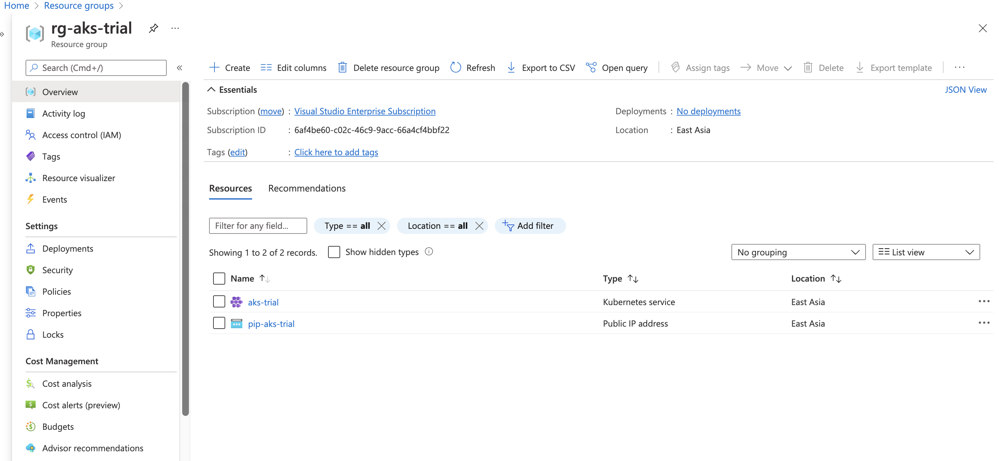
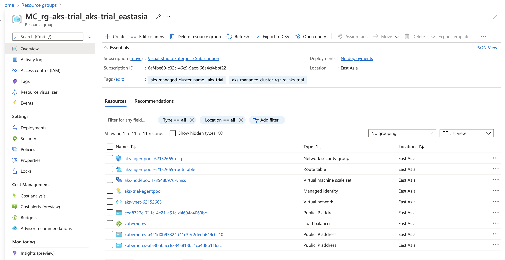
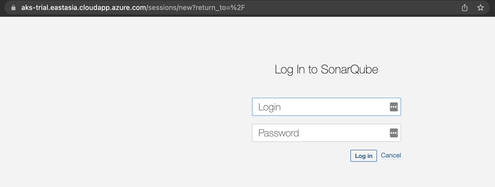
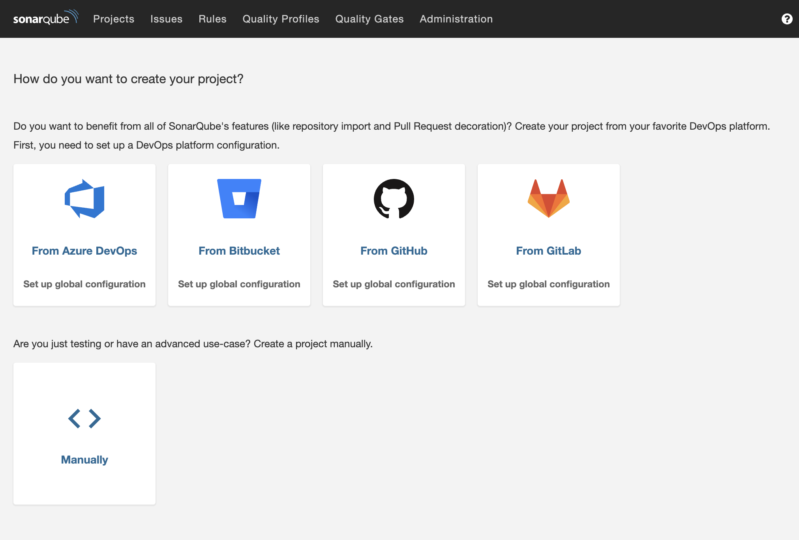

# My project is for The Microsoft Azure Trial Hackathon on Dev.to

- [Dev.to](https://dev.to/ninefyi/azure-trial-hackathon-sonarqube-community-branch-plugin-on-aks-4pjb-temp-slug-8928180)
- [Plugin](https://github.com/mc1arke/sonarqube-community-branch-plugin)
- [Azure-CLI](https://docs.microsoft.com/en-us/cli/azure/install-azure-cli)

### Instruction

1. az login
2. az account set -s "[Subscription name]"
3. az group create --name rg-aks-trial --location eastasia
4. az network public-ip create -g rg-aks-trial -n pip-aks-trial --dns-name aks-trial --allocation-method Static --sku Standard
5. az aks create --resource-group rg-aks-trial --name aks-trial --node-count 3 --node-vm-size Standard_B2s
6. az aks install-cli
7. az aks get-credentials --name aks-trial -g rg-aks-trial --admin
8. az aks show -g rg-aks-trial -n aks-trial --query "identity.principalId" -o tsv
9. az account show --query "id" -o tsv
10. az role assignment create --assignee "answer_no_8" --role "Network Contributor" --scope subscriptions/answer_no_9/resourceGroups/rg-aks-trial
11. az network public-ip list -g rg-aks-trial -o tsv --query "[].ipAddress"
12. kubectl config use-context aks-trial-admin
13. kubectl create namespace my-sonarqube
14. kubectl apply -f ./aks/postgres
15. kubectl apply -f ./aks/sonarqube
16. kubectl label namespace my-sonarqube cert-manager.io/disable-validation=true
17. helm repo add ingress-nginx https://kubernetes.github.io/ingress-nginx
18. helm repo add jetstack https://charts.jetstack.io
19. helm repo update
20. helm install nginx-ingress ingress-nginx/ingress-nginx \
    --version 4.0.13 \
    --namespace my-sonarqube \
    --set controller.replicaCount=2 \
    --set controller.nodeSelector."kubernetes\.io/os"=linux \
    --set defaultBackend.nodeSelector."kubernetes\.io/os"=linux \
    --set controller.service.loadBalancerIP="answer_no_11" \
    --set controller.service.annotations."service\.beta\.kubernetes\.io/azure-load-balancer-resource-group"="rg-aks-trial"
21. helm install cert-manager jetstack/cert-manager \
    --namespace my-sonarqube\
    --version "v1.7.1" \
    --set installCRDs=true \
    --set nodeSelector."kubernetes\.io/os"=linux
22. kubectl apply -f ./aks/cluster-issuer.yml
23. az network public-ip list -g rg-aks-trial -o tsv --query "[].ipAddress"
24. az network public-ip list -g rg-aks-trial -o tsv --query "[].dnsSettings.fqdn"
25. kubectl apply -f ./aks/nginx.ingress.yml

## Screenshot

